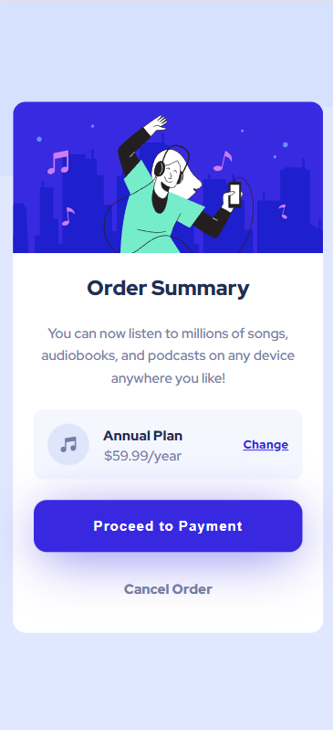
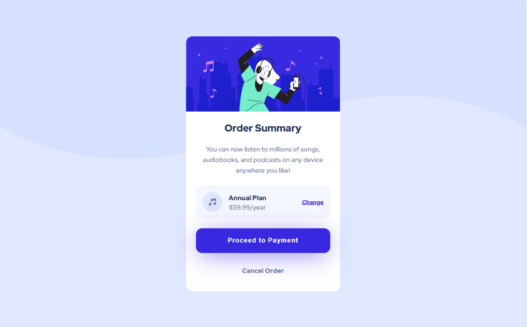

# Frontend Mentor - Order summary card solution

This is a solution to the [Order summary card challenge on Frontend Mentor](https://www.frontendmentor.io/challenges/order-summary-component-QlPmajDUj). Frontend Mentor challenges help you improve your coding skills by building realistic projects. 

## Table of contents

- [Overview](#overview)
  - [The challenge](#the-challenge)
  - [Screenshot](#screenshot)
  - [Links](#links)
- [My process](#my-process)
  - [Built with](#built-with)
  - [Useful resources](#useful-resources)
- [Author](#author)
- [Acknowledgments](#acknowledgments)

## Overview

### The challenge

Users should be able to:

- See hover states for interactive elements

### Screenshot(s)

1. Mobile Solution

2. Desktop Solution

### Links

- Solution URL: [Add solution URL here](https://www.frontendmentor.io/solutions/order-summary-card-challenge-using-html-and-css-1q5FHN_7BS)
- Live Site URL: [Add live site URL here](acc-fm-order-summary-component.netlify.app)

## My process

### Built with

- Semantic HTML5 markup
- CSS custom properties
- Flexbox
- Mobile-first workflow

## Author

- Website - [Alana Caporale](https://alanacapcreates.com)
- Frontend Mentor - [@AlanaCapCreates](https://www.frontendmentor.io/profile/alanacapcreates)
- Twitter - [@AlanaCapCreates](https://www.twitter.com/alanacapcreates)
- Instagram - [@AlanaCap.Creates](https://www.instagram.com/alanacap.creates/?hl=en)

## Acknowledgments

Thank you to those that gave me suggestions in my live stream!
